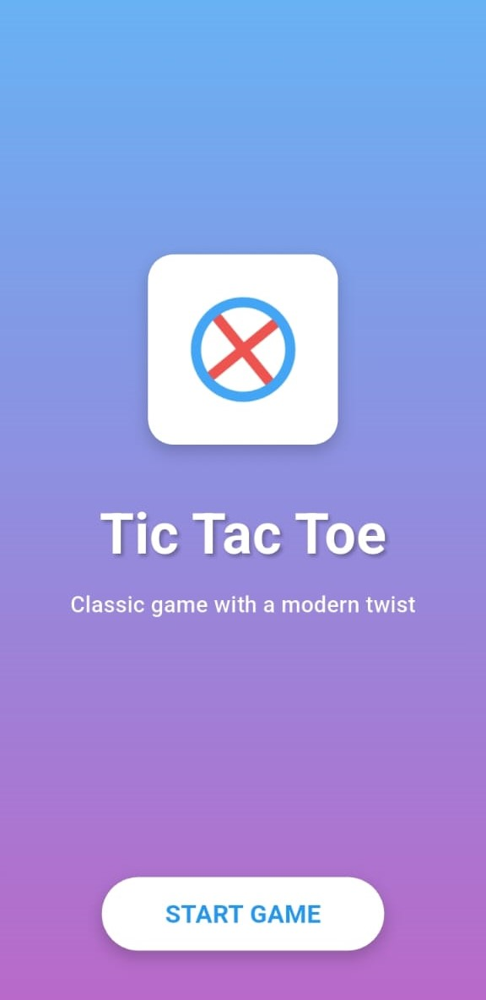
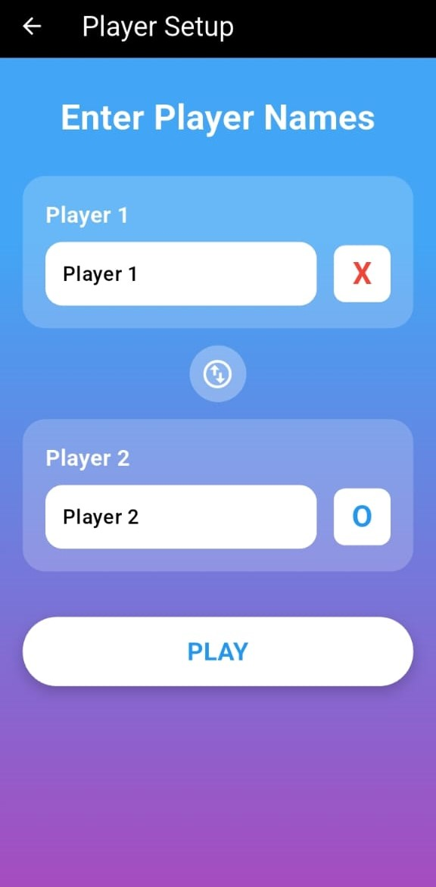
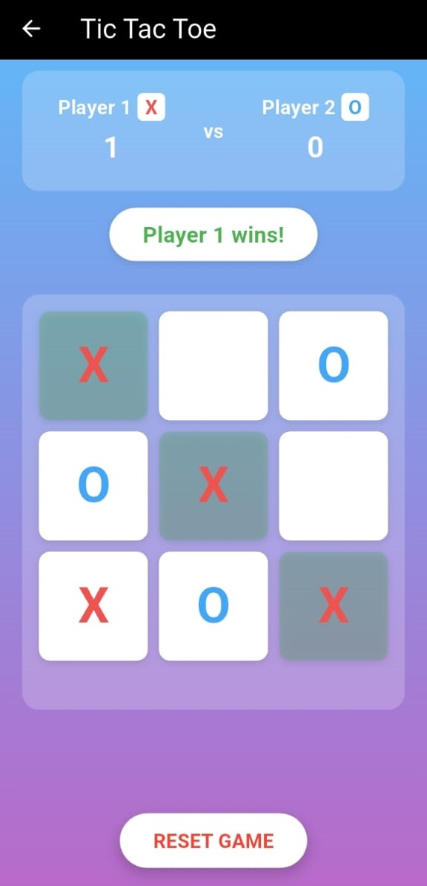

🎮 Tic Tac Toe - Flutter Game

📌 Overview

Tic Tac Toe is a classic two-player game developed using Flutter. The game features a simple and 
intuitive user interface, making it fun and easy to play. It supports both light and dark themes 
and provides a seamless gaming experience.

🛠 Features

✅ Classic Gameplay – Players take turns placing X and O in a 3x3 grid. The first player to align 
three marks in a row, column, or diagonal wins.
✅ Beautiful UI – Designed with a modern, clean look using the Poppins font and smooth animations.
✅ Back Navigation – Easily return to the home screen using the back button.
✅ Responsive Design – Optimized for various screen sizes, including tablets and phones.
✅ Optimized Performance – Ensures smooth and lag-free gameplay.

🏗 Technologies Used
Flutter (Dart)
Material Design
State Management
Theme Support

ScreenShots

